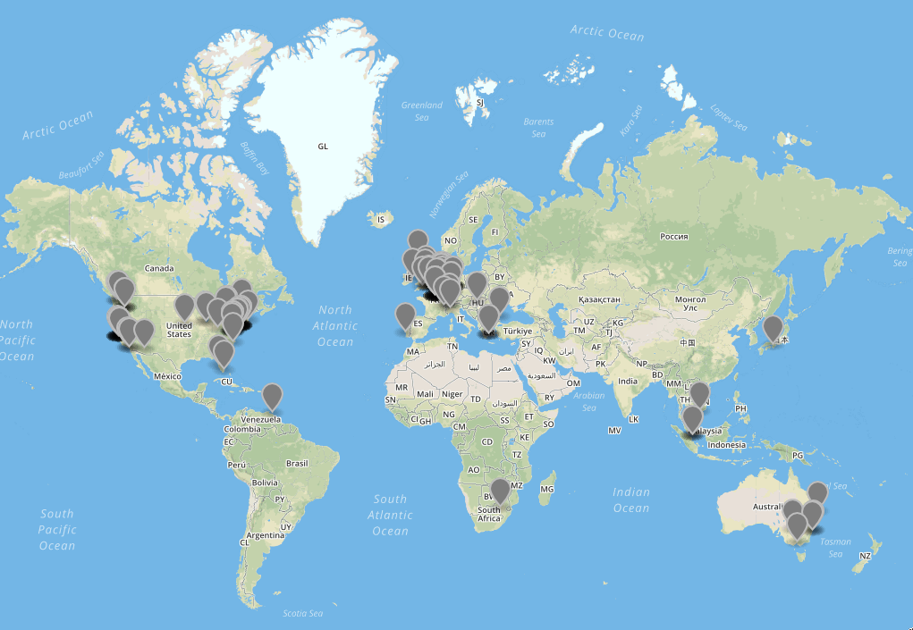

# codius-map

Some scripts to generate a map of Codius hosts.



## Install dependencies

After cloning this repository, install the dependencies. (You need [Node.js](https://nodejs.org) v10.x.x or higher.)

```sh
npm install
```

## Build data

First, please update the GeoIP database:

```sh
cd node_modules/geoip-lite
npm run updatedb
cd ../..
```

To build the data from hosts.txt, run:

```sh
npm run build
```

## Output

* `hosts.json` - Custom format containing some data about each host.
* `hosts.geo.json` - Data about hosts in GeoJSON format.
